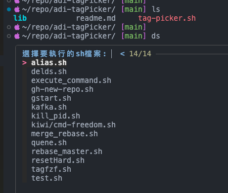
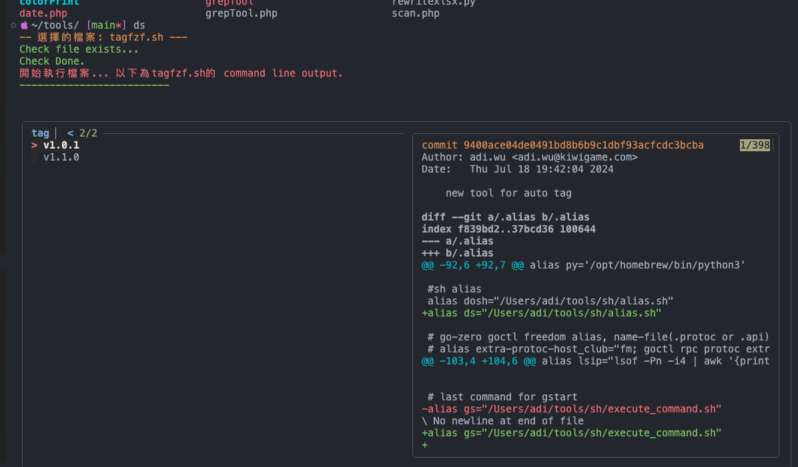
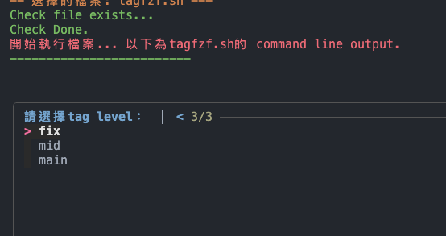

# Install 

install fzf using brew:
```
brew install fzf
```

install zsh sheel:

```
brew install zsh
```

install oh-my-zsh:

```
sh -c "$(curl -fsSL https://raw.githubusercontent.com/robbyrussell/oh-my-zsh/master/tools/install.sh)"
```

install powerlevel10k:

```
git clone --depth=1 https://github.com/romkatv/powerlevel10k.git ${ZSH_CUSTOM:-$HOME/.oh-my-zsh/custom}/themes/powerlevel10k
```

add the following to your ~/.zshrc file:

```
ZSH_THEME="powerlevel10k/powerlevel10k"
plugins=(git fzf)
```

source the file:

```
source ~/.zshrc
```

install fzf-tab:

```


# Usage

you can use my aother repo name adi-dosh for alias sheel script.

alias.sh >>>


choose adi-tagPicker.sh >>>


choose tag

e.g. `1.2.3`

if you choose main...
main => 2.0.0 

if you choose mid...
main => 1.3.0

if you choose fix...
main => 1.2.4 

