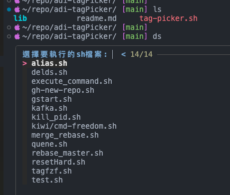
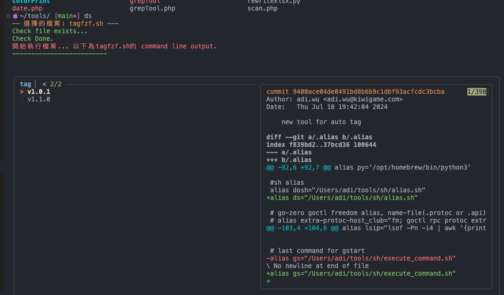
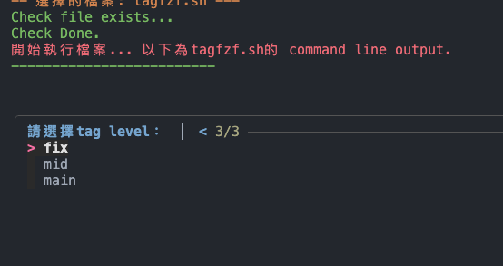

# Simple Tag picker 

This is a simple tag picker for using with git tags.
Cause Doing the project development always tag a new version with develop feature.
You can use this script to choose the tag version u want to use.

Maybe your app with the complex tag like `kernelService-mircoService-v1.2.3` ...
imagine the product have 10 services.

Hope can save your time.

# Install 

install fzf using brew:
```
brew install fzf
```


# Usage

you can use my aother repo name adi-dosh for alias sheel script.

alias.sh >>>


choose adi-tagPicker.sh >>>


版本的選擇規則為:
opt=("main", "mid", "fix")

選擇main調整大版本號, mid為新服務更新, fix為bug修復版本號
main => 2.0.0 
mid => 1.3.0
fix => 1.2.4 

