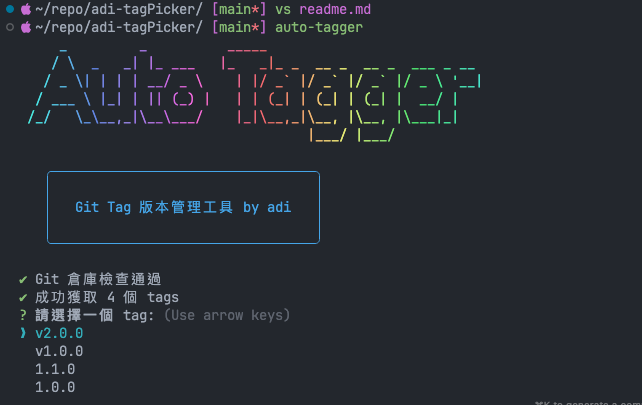
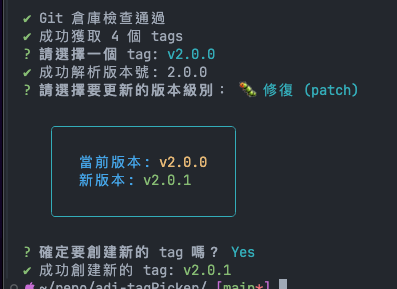

# auto-tagger

<h1 align="center">Welcome to auto-tagger 👋</h1>
<p>
  <a href="https://www.npmjs.com/package/auto-tagger" target="_blank">
    
  </a>
  <a href="#" target="_blank">
    
  </a>
</p>

>This is a simple tag picker for using with git tags.
>Cause Doing the project development always tag a new version with develop feature.
>You can use this script to choose the tag version u want to use.

>Maybe your app with the complex tag like `kernel-mircoservice-v1.2.3` ...
>imagine the product have 10 services.

>Hope can save your time.

# Support

- shell script
- npm 

## Npm

- name: auto-tagger

### Install

```
npm install -g auto-tagger
```

in your project dir
```
cd /file/to/your/project/; auto-tagger
```

and you will see the tag list.


Choose the tag for the last commit.



AND DON'T FORGET TO PUSH THE TAG TO THE REMOTE REPO.

之後優化自動push：
```
git push --tags
```

## Shell

### Install 
install fzf using brew:
```
brew install fzf
```

### Usage

you can use my aother repo name adi-dosh for alias sheel script.

alias.sh >>>


choose adi-tagPicker.sh >>>


版本的選擇規則為:
opt=("main", "mid", "fix")

選擇main調整大版本號, mid為新服務更新, fix為bug修復版本號
main => 2.0.0 
mid => 1.3.0
fix => 1.2.4 


## Author

👤 **adi**

## Show your support

Give a ⭐️ if this project helped you!

***
_This README was generated with ❤️ by [readme-md-generator](https://github.com/kefranabg/readme-md-generator)_